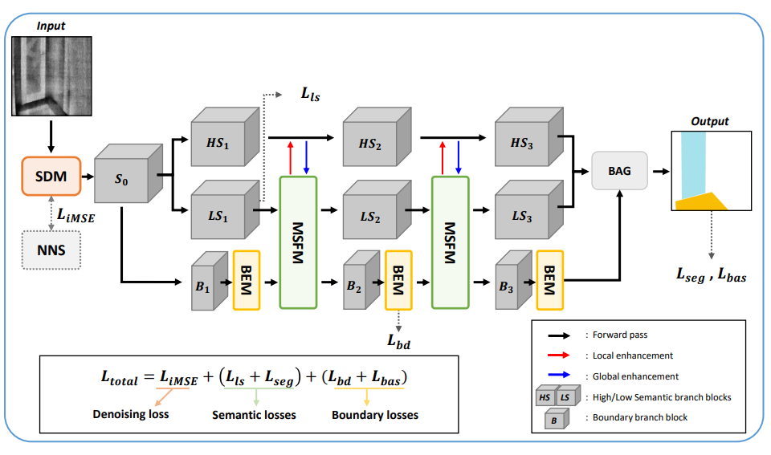

# pytorch_efficientirseg

This repository contains the implementation of our deep learning model.

## Model Architecture
Here is a visual representation of our model:

---
## 🚀 To-Do List

This repository is currently under development. Below are the planned tasks:

### 📌 Project Setup
- [ ] Add setup instructions for the training environment
- [ ] Include `requirements.txt` or a setup guide for dependencies

### 🏗 Code Development
- [ ] Implement model architecture
- [ ] Add training script (`train.py`)
- [ ] Include data preprocessing scripts
- [ ] Create evaluation and testing scripts (`test.py`)
- [ ] Optimize and fine-tune model performance

### 📄 Documentation
- [ ] Write a usage guide (`USAGE.md`)

---

